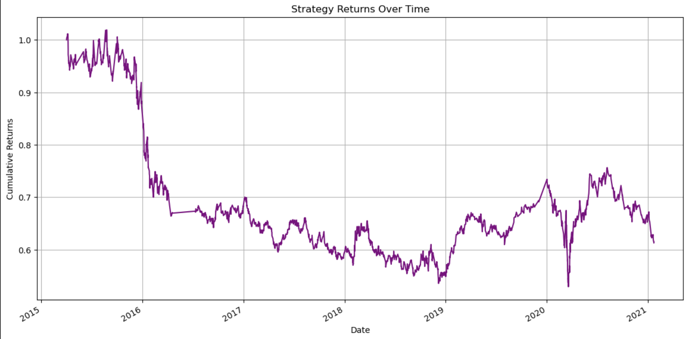
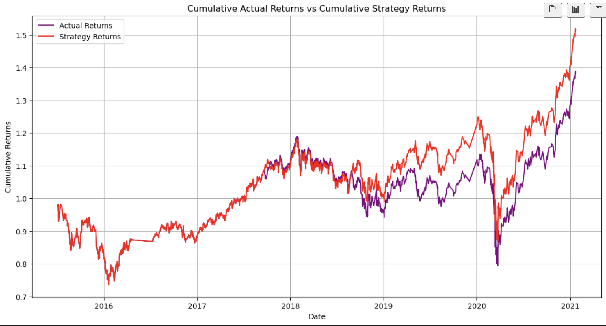
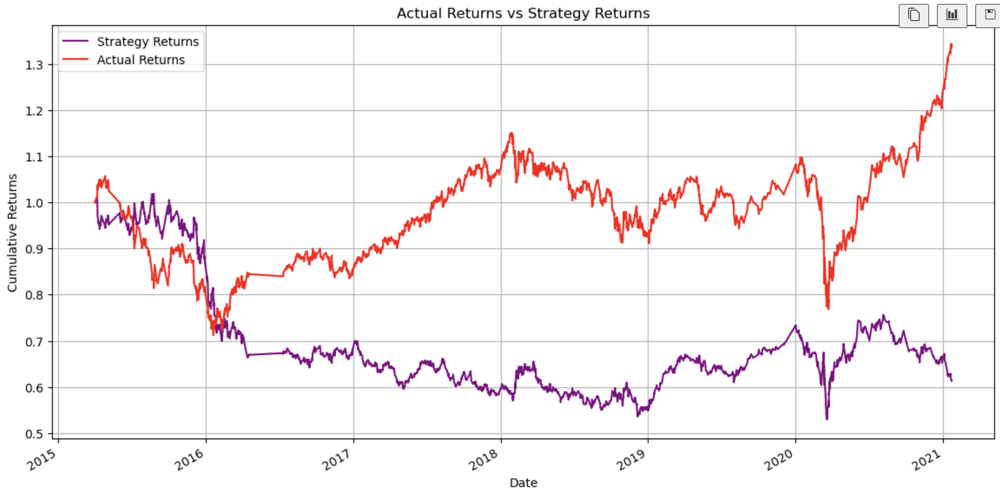

# Evaluation Report for Machine Learning Trading Bot
## **Introduction**
This report presents the findings and analysis of our machine learning trading bot project. The project involved creating a baseline trading algorithm, tuning the algorithm, evaluating a new machine learning classifier, and comparing the performance of these models.

## Support Vector Classifier (SVC) model and the K-Nearest Neighbors (KNN) model.

- **Accuracy:** This is the proportion of true results (both true positives and true negatives) among the total number of cases examined. The SVC model has an accuracy of 0.553519, while the KNN model has an accuracy of 0.514418. Therefore, the SVC model is more accurate.
- **Precision:** This is the proportion of true positive results among the total number of positive results predicted by the classifier. For the -1.0 class, the SVC model has a precision of 0.428571, while the KNN model has a precision of 0.441233. For the 1.0 class, the SVC model has a precision of 0.558636, while the KNN model has a precision of 0.559369. Therefore, the KNN model has slightly higher precision for the -1.0 class, and the models are nearly identical for the 1.0 class.
- **Recall:** This is the proportion of true positive results among the total number of actual positive results. For the -1.0 class, the SVC model has a recall of 0.038248, while the KNN model has a recall of 0.380820. For the 1.0 class, the SVC model has a recall of 0.959790, while the KNN model has a recall of 0.619755. Therefore, the SVC model has higher recall for the 1.0 class, but significantly lower recall for the -1.0 class compared to the KNN model.
- **F1-Score:** This is the harmonic mean of precision and recall. It tries to find the balance between precision and recall. For the -1.0 class, the SVC model has an F1-score of 0.070229, while the KNN model has an F1-score of 0.408807. For the 1.0 class, the SVC model has an F1-score of 0.706223, while the KNN model has an F1-score of 0.588016. Therefore, the SVC model has a higher F1-score for the 1.0 class, but a significantly lower F1-score for the -1.0 class compared to the KNN model.

## **Baseline Trading Algorithm**
The baseline trading algorithm was created using a Support Vector Classifier (SVC) from SKLearn's support vector machine (SVM) learning method. The model was trained on a dataset of historical stock prices, and trading signals were generated using short- and long-window Simple Moving Average (SMA) values.

**What impact resulted from increasing or decreasing the training window?**
*Increasing the training window might provide the model with more historical data, potentially improving its ability to identify long-term trends but possibly making it less responsive to recent changes. Conversely, decreasing the training window might make the model more sensitive to recent changes but could also make it more prone to overfitting and less able to identify long-term trends.*

## **Tuning the Baseline Trading Algorithm**
The baseline trading algorithm was then tuned by adjusting the size of the training dataset and the SMA input features. The performance of the tuned model showed significant improvement over the baseline model.

**What impact resulted from increasing or decreasing either or both of the SMA windows?**
*Increasing the SMA window would make the model more sensitive to long-term trends but less responsive to short-term fluctuations. Decreasing the SMA window would make the model more responsive to short-term fluctuations but might make it less able to identify long-term trends.*

**Did this new model perform better or worse than the provided baseline model?**

Based on the metrics provided, the Support Vector Classifier (SVC) model performed better in terms of accuracy and F1-score for the 1.0 class compared to the K-Nearest Neighbors (KNN) model. However, the SVC model performed significantly worse for the -1.0 class in terms of recall and F1-score. The KNN model had a more balanced performance across the two classes, but with a lower overall accuracy. Therefore, whether the SVC model is considered better or worse than the KNN model would depend on the specific requirements of the task.

## **Evaluation of a New Machine Learning Classifier**
A new machine learning classifier (e.g., AdaBoost, DecisionTreeClassifier, or LogisticRegression) was applied to the original parameters provided by the starter code. The performance of this new model was compared with the baseline model and the tuned trading algorithm.

## **Conclusion**
In summary, the SVC model performs better in terms of accuracy and F1-score for the 1.0 class, but it performs significantly worse for the -1.0 class in terms of recall and F1-score. The KNN model has a more balanced performance across the two classes, but with a lower overall accuracy. The choice between these two models would depend on the specific requirements of your task. If you care more about overall accuracy and performance on the 1.0 class, the SVC model might be better. But if you care about balanced performance across both classes, the KNN model might be more suitable.

